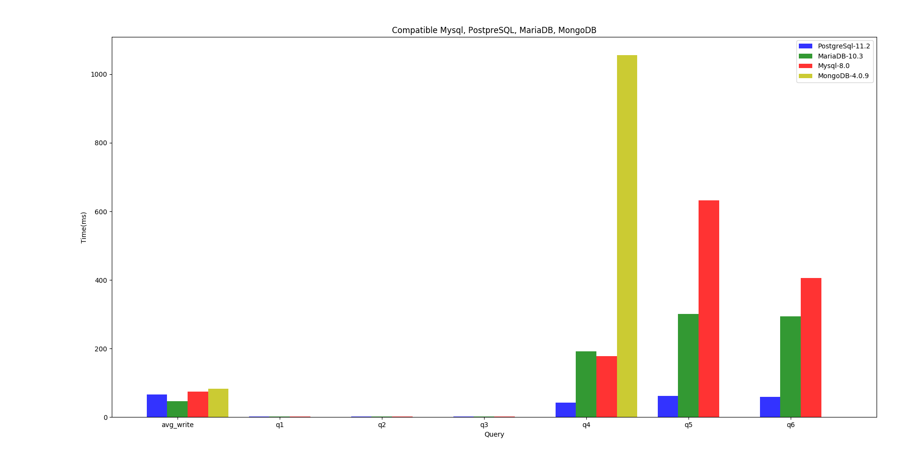

# Compare Database: MySQL, PostgreSQL, Maria DB (MongoDB with do later)
## 1.How to metric
### Step 1: prepare environment for test: see at [docker](https://github.com/huongnhdh/db_bench/blob/master/docker.txt)

| Database management system                                      | version | env |
| ---------------------------------------------- | ------ | --- |
| [Mysql](https://github.com/mysql/mysql-server) |      8.0  | [mysql image](https://hub.docker.com/_/mysql)    |
| [MariaDB](https://github.com/MariaDB/server)   |       10.3 |  [MariaDB image](https://hub.docker.com/_/mariadb)   |
| [PostgreSQL](https://github.com/postgres/postgres)|     11.2  | [Postgres image](https://hub.docker.com/_/postgres)     |
| [MongoDB](https://github.com/mongodb/mongo)|    4.0.9    |  [Mongo image](https://hub.docker.com/_/mongo)   |

The ENV of running script is: Python 2.7 with Ubuntu 18.10 (SSD 128G)

### Step 2: Prepare DataSet see data set
  A table has 3 column(1 random latin text, 2 random integer), without  index
  see at:
  - https://github.com/huongnhdh/db_bench/blob/master/sql/insert.sql
  - https://github.com/huongnhdh/db_bench/blob/master/nosql/data.json

### Step 3: Run some query for measure time:
  Please see for more detail
  - https://github.com/huongnhdh/db_bench/blob/master/benchmark.py
  - For read:  running 100 times on data-set 1.000.000 rows
  - For write: running 100 times for bulk insert each time are 10.000 rows

  | Query Type  | query 1 (q1)  | query 2 (q2)  | query 3 (q3)  | query 4(q4) |query 5 (q5) |query 6(q6)|
  |---|---|---|---|---|---|---|  
  | SQL  | `SELECT * FROM testing LIMIT 1000`  |`SELECT * FROM testing WHERE int_col > 5000 LIMIT 1000`   |`SELECT * FROM testing WHERE int_col + int_col2 > 12345 LIMIT 1000`   |`SELECT COUNT(*) FROM testing WHERE int_col + int_col2 > 12345`   |`SELECT * FROM testing WHERE int_col > 5000 ORDER BY word_col ASC LIMIT 1000`|`SELECT * FROM testing WHERE word_col LIKE '%lim%' ORDER BY word_col DESC LIMIT 1000`|
  | MongoDB(NoSQL)  | `find().limit(1000) ` | `find({'int_col': {"$gt": 5000}}).limit(1000)`  |`aggregate.([{"$addFields":{"sum":{"$sum":["$int_col","$int_col2"]}}},{"$match":{"sum":{"$gt":12345}}},{"$limit": 1000}])`| `aggregate.([{"$addFields":{"sum":{"$sum":["$int_col","$int_col2"]}}},{"$match":{"sum":{"$gt":12345}}},{"$count": "totalCount"}])` |`find({'int_col': {"$gt": bson.int64.Int64(5000)}}).sort([("word_col", pymongo.ASCENDING)]).limit(1000)`|`.find({"word_col":  "/.*lim.*/"}).sort([("word_col", pymongo.DESCENDING)]).limit(1000)`|

## 2. The report

Note: The images below was generate from report

Raw summary result of avg execute 100 times:

|Database management system  |Write batch data | q1 | q2 | q3 |q4 | q5 | q6|
|---|---|---|---|---|---|---|---|
|Mariadb-10.3| **`46.8200927734`**| 1.50604248047| 1.78776123047| 1.78776123047| 192.414335937| 301.729423828| 293.925852051|
|Mongodb-4.0.9| 82.704220007 | **`0.0346118164063`**| **`0.0348852539062`**| **`0.0348852539062`**|1055.94130371| **`0.0642456054687`**| **`0.0800732421875`**|
|Mysql-8.0| 75.0042041016| 2.2075| 2.18768066406| 2.18768066406| 177.359348145| 631.993063965| 406.15064209|
|PostpreSQL-11.2| 66.9281835938| 1.25299072266| 1.53550048828| 1.73638427734| **`42.7281103516`**| 62.4191040039| 58.9514770508|

The raw of result at https://github.com/huongnhdh/db_bench/tree/master/benchmark

## 3. Conclusion.
- avg write time (batch insert): MariaDB win
- q1: (`select` with `limit`): MongoDB win
- q2: (`select` with `where` and `limit`): MongoDB win
- q3: (`select` with `where(>, +)` and `limit`): MongoDB win
- q4: (`select` with `count` for `where( <, + )`): PostgreSQL win
- q5: (`select` with `where(> )` `order by` and `asc` and `limit`): MongoDB win
- q6: (`select` with `where(like)` `order by` and `asc` and `limit`): MongoDB win

