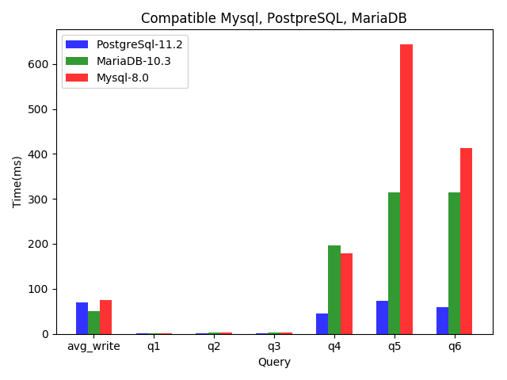

# Compare Database: MySQL, PostgreSQL, Maria DB (MongoDB with do later)
## 1.How to metric
| Database management system                                      | version | env |
| ---------------------------------------------- | ------ | --- |
| [Mysql](https://github.com/mysql/mysql-server) |      8.0  | [mysql image](https://hub.docker.com/_/mysql)    |
| [MariaDB](https://github.com/MariaDB/server)   |       10.3 |  [MariaDB image](https://hub.docker.com/_/mariadb)   |
| [PostgreSQL](https://github.com/postgres/postgres)|     11.2  | [Postgres image](https://hub.docker.com/_/postgres)     |
| ~~[MongoDB](https://github.com/mongodb/mongo)~~|        |     |


## 2. The report for basic syntax



Note: The images below was generate from report
```
avg_write: average write time of 10000 rows
q1: SELECT * FROM testing LIMIT 1000
q2: SELECT * FROM testing WHERE int_col > 5000 LIMIT 1000
q3: SELECT * FROM testing WHERE int_col + int_col2 > 12345 LIMIT 1000
q4: SELECT COUNT(*) FROM testing WHERE int_col + int_col2 > 12345
q5: SELECT * FROM testing WHERE int_col > 5000 ORDER BY word_col ASC LIMIT 1000
q6: SELECT * FROM testing WHERE word_col LIKE '%lim%' ORDER BY word_col DESC LIMIT 1000
```
*Ref:*
- https://stackshare.io/stackups/mariadb-vs-mysql-vs-postgresql
- The raw of result at https://github.com/huongnhdh/db_bench/tree/master/benchmark
## 3. Conclusion.
- avg write time (batch insert): MariaDB win
- `select` with `limit`: same
- `select` with `where` and `limit`: same
- `select` with `where(>)` and `limit`: same
- `select` with `count`, `where( <, + )`: PostgreSQL win
- `select` with `where(>, +)` `order by` and `asc` and `limit`: PostgreSQL win
- `select` with `where(> )` `order by` and `asc` and `limit`: PostgreSQL win
- `select` with `where(like)` `order by` and `asc` and `limit`: PostgreSQL win
